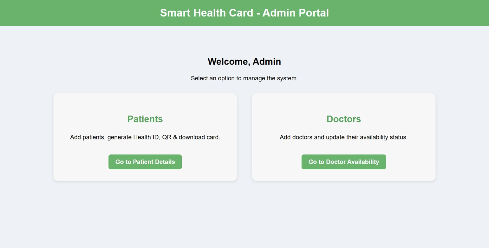
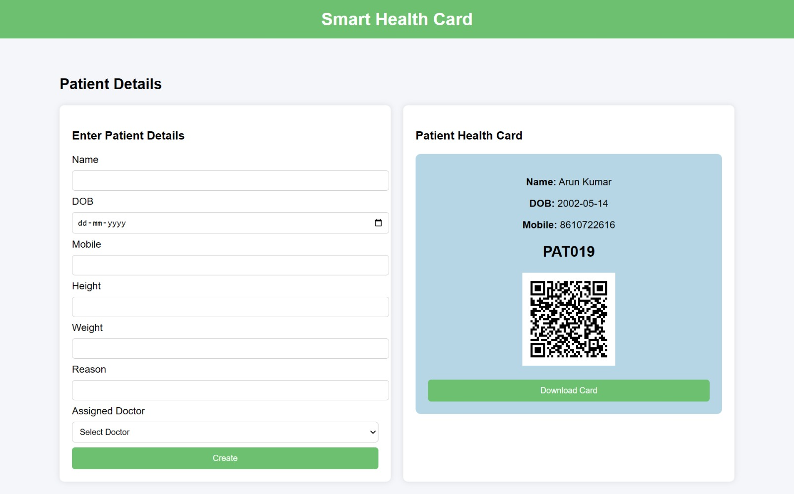
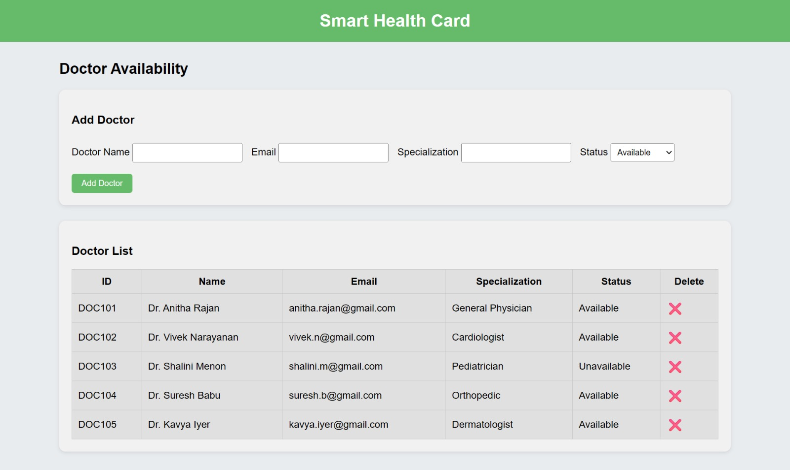
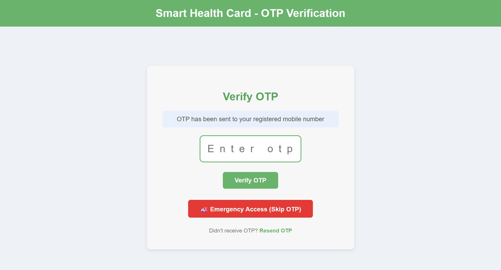
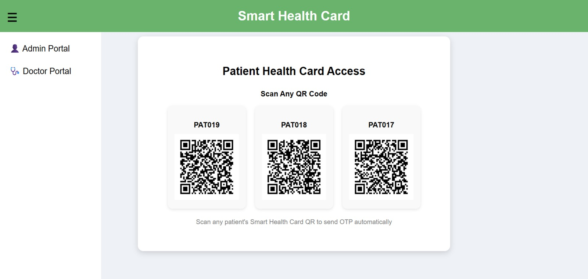
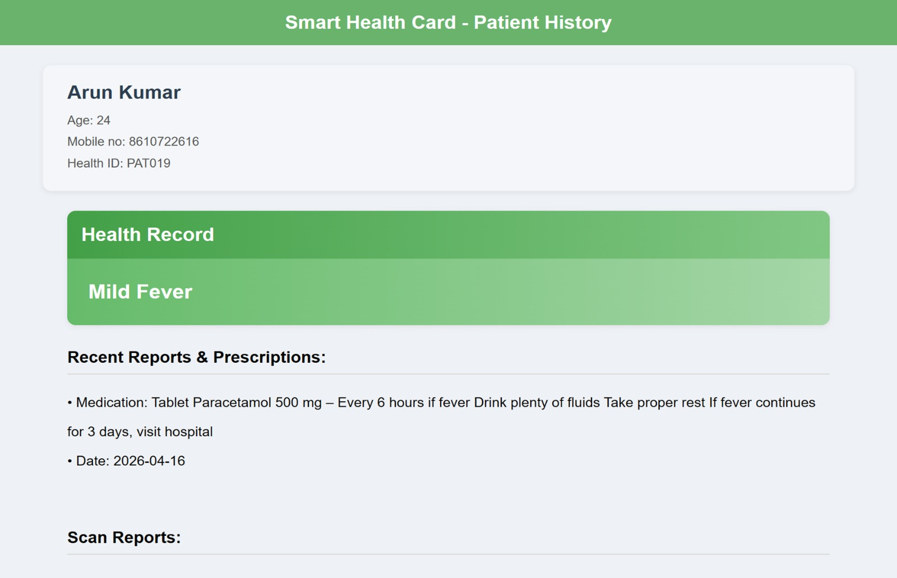
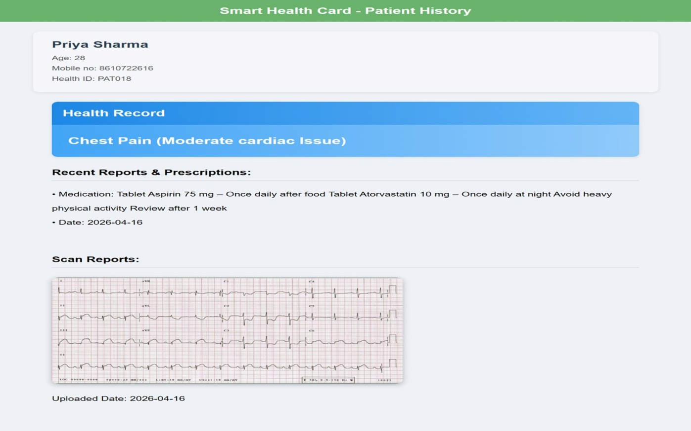
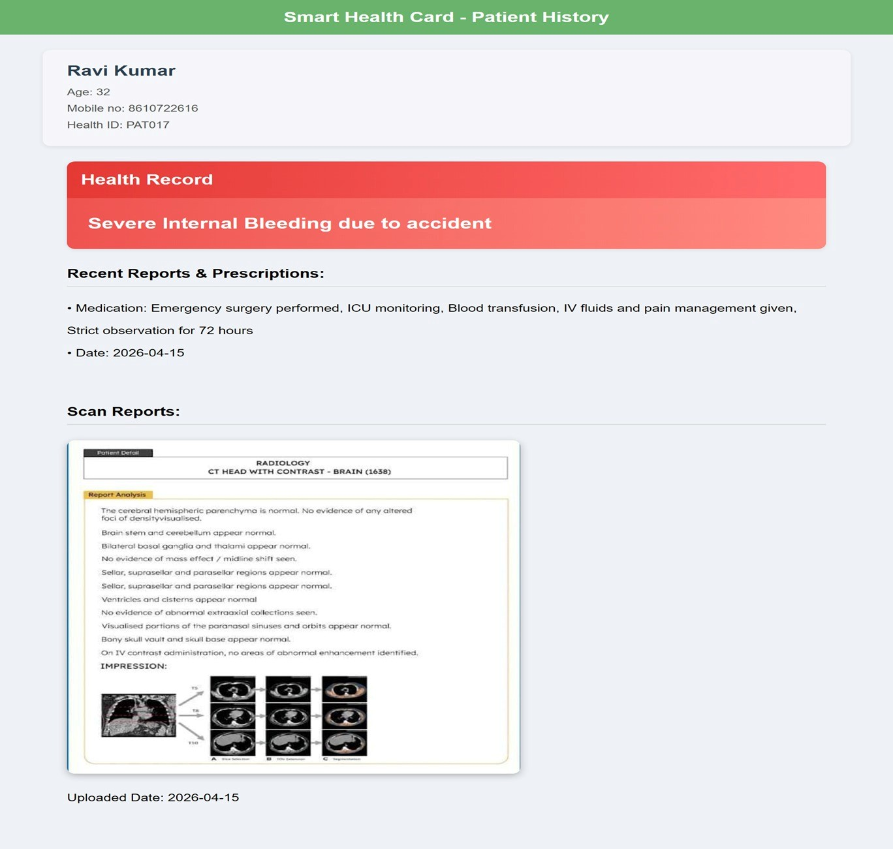

# 🏥 Smart Health Card System

A QR-based Smart Health Card System developed using **Flask**, **Python**, and **MySQL** to securely store and manage patient health records. The system enables patients and healthcare providers to access medical information through QR code scanning while ensuring secure authentication.

## 🚀 Features

- 👤 Patient registration and login
- 🔐 OTP-based authentication
- 🏥 Digital health card generation
- 📱 QR code generation for patient records
- 📋 Secure patient profile management
- 💾 MySQL database integration
- 🌐 Responsive web interface

## 🛠️ Tech Stack

- **Backend:** Python, Flask
- **Frontend:** HTML, CSS, JavaScript
- **Database:** MySQL
- **Authentication:** OTP Verification
- **Libraries:** qrcode, Flask, MySQL Connector

## 📂 Project Structure

```
Smart_Health_Card/
│── app.py
│── templates/
│── static/
│── README.md
│── requirements.txt
```

## ⚙️ Installation

1. Clone the repository

```bash
git clone https://github.com/harshinisrinivasan15/Smart_Health_Card.git
```

2. Navigate to the project folder

```bash
cd Smart_Health_Card
```

3. Install dependencies

```bash
pip install -r requirements.txt
```

4. Configure your MySQL database.

5. Run the application

```bash
python app.py
```

6. Open your browser and visit

```
http://127.0.0.1:5000
```

## 👥 Team Project

This project was developed as part of a team project.

### My Contributions

- Developed backend features using Flask
- Integrated MySQL database
- Implemented QR code functionality
- Added OTP-based authentication
- Built and tested application modules
- Resolved Git merge conflicts and integrated updates

## 📸 Screenshots

### Admin Page


### Patient Dashboard


### Doctor Dashboard


### OTP Authentication


### QR Codes


### Digital Health Card




## 🔮 Future Improvements

- Cloud Deployment
- Role-Based Access Control

## 📧 Contact

**Harshini S.**

GitHub: https://github.com/harshinisrinivasan15

LinkedIn: https://www.linkedin.com/in/harshini-srinivasan-7a1981372/
